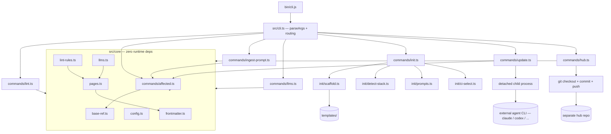

# wiki-kit Design

**Spec**: `.specs/features/wiki-kit/spec.md`
**Context**: `.specs/features/wiki-kit/context.md`
**Status**: Draft

Builds on `docs/superpowers/specs/2026-08-14-package-architecture-design.md`,
already approved — this document narrows that architecture into concrete
components/interfaces and adds `update`, the `init`-time hub question, and
the risks found while re-reading the reference source in full for this
Design pass (`FOUNDATION.md`'s "10 rules" undercount and the `**` glob note
were already caught during Specify; two more surfaced here, see Risks &
Concerns).

**Approach exploration:** already done and approved during the brainstorming
session that produced the architecture design doc — module layout (mirror
reference vs. reorganize by feature), CLI dependency policy (stdlib vs.
`commander`), and hub mechanism (copy+push vs. `repository_dispatch`) were
each presented with 2-3 options and a recommendation there. Not re-derived
here; outcomes are recorded as AD-001/AD-005/AD-006 in `.specs/STATE.md`.

---

## Architecture Overview

Four command groups, one shared zero-dependency core:



`update` and `hub push` are the only components that reach outside the
process (spawn a CLI, push over git) — everything else is pure
read-files/compute/write-files, matching the reference's own shape.

---

## Code Reuse Analysis

### Existing Components to Leverage

| Component | Location (reference) | How to Use |
| --- | --- | --- |
| Front-matter parser | `wiki/scripts/lib/frontmatter.mjs` (154 lines) | Port to `src/core/frontmatter.ts` near-verbatim, add types. Zero behavior change — the loop-termination regression this already guards against (`FOUNDATION.md` §9) must keep passing unmodified. |
| Page loading / glob matching | `wiki/scripts/lib/pages.mjs` (179 lines) | Port to `src/core/pages.ts`. One real change required, not cosmetic — see Risks & Concerns (`WIKI_DIR`/`REPO_ROOT` resolution). |
| 11-rule lint registry | `wiki/scripts/wiki-lint.mjs` `RULES` array (lines 43-231) | Port to `src/core/lint-rules.ts` as the same ordered, named array — `CLAUDE.md`'s own convention ("adding a check means adding one entry, nothing else") already matches this shape 1:1. |
| Base-ref detection + `--affected`/`--prompt` | `wiki-lint.mjs` lines 261-470 | Port to `src/core/base-ref.ts` (`resolveBase`, `refExists`, `changedFiles`, `computeAffected`) + `src/commands/affected.ts` (`printAffected`) + `src/commands/ingest-prompt.ts` (`printPrompt`, translated to English). |
| `llms.txt`/`llms-full.txt`/`map.json`/OKF bundle generator | `wiki/scripts/wiki-llms.mjs` (174 lines) | Port to `src/core/llms.ts`, translating generated-content labels (`Origem:` → `Source:`, etc. — see Tech Decisions). |
| Stack-detection table | `.claude/skills/wiki-kit/references/BOOTSTRAP.md` §1 | Port the manifest→stack table (`go.mod`, `composer.json`, `package.json`, `pyproject.toml`/`setup.cfg`, `Cargo.toml`, `pom.xml`/`build.gradle`, `Gemfile`) into `src/init/detect-stack.ts`, translated. |
| Template skeleton | `.claude/skills/wiki-kit/template/**` | Copy into `templates/`, translating doc sections (§7's table) and Portuguese prose. Placeholders (`{{...}}`) appear in exactly 3 files today: `docusaurus.config.js`, `docs/index.md`, `github/wiki.yml` — confirmed by grep, not assumed. |
| Reference test suite | `tests/wiki/*.test.ts` (4 files, 347 lines) | Port to `test/*.test.ts`, same assertions (AD-008). |

### Integration Points

| System | Integration Method |
| --- | --- |
| Target repo's git | `execFileSync("git", [...])`, same pattern as the reference — never a git library dependency (would violate AD-001). |
| External agent CLI (`update`) | Spawn by binary name read from `update.agent` config, detached (`spawn(..., {detached:true, stdio:[...]}).unref()`), matching the fire-and-forget decision in `context.md`. |
| Hub repo (`hub push`) | Plain git over a local checkout (clone-or-reuse a working dir under a temp/cache path), `WIKI_HUB_TOKEN` injected into the remote URL or an askpass helper — never shelled into an interactive credential prompt. |

---

## Components

### `src/core/frontmatter.ts`

- **Purpose**: Parse the OKF/Docusaurus front-matter YAML subset without a YAML dependency.
- **Location**: `src/core/frontmatter.ts`
- **Interfaces**:
  - `splitFrontMatter(text: string): [head: string, body: string]`
  - `parseFrontMatter(head: string): Record<string, unknown>`
  - `readFrontMatter(text: string): { data: Record<string, unknown>; body: string }`
- **Dependencies**: none (stdlib only)
- **Reuses**: `frontmatter.mjs`, ported near-verbatim with types added

### `src/core/pages.ts`

- **Purpose**: Load every page, compute sidebar order, glob-match `sources:` against tracked files, build the reverse source→page index.
- **Location**: `src/core/pages.ts`
- **Interfaces**:
  - `findRepoRoot(cwd: string): string` — **new**, not in the reference (see Risks & Concerns)
  - `loadPages(wikiDir: string): Page[]`
  - `normalizeSources(raw: unknown): string[]`
  - `trackedFiles(repoRoot: string): string[]`
  - `globToRegExp(glob: string): RegExp`
  - `expandSource(pattern: string, repoRoot: string): string[]`
  - `buildSourceMap(pages: Page[]): Map<string, Set<string>>`
- **Dependencies**: `frontmatter.ts`, `node:child_process` (`git ls-files`)
- **Reuses**: `pages.mjs`, ported with `WIKI_DIR`/`REPO_ROOT` resolution redesigned

### `src/core/config.ts`

- **Purpose**: Load and validate `wiki/wiki-kit.config.yaml`.
- **Location**: `src/core/config.ts`
- **Interfaces**:
  - `loadConfig(wikiDir: string): WikiKitConfig` (see Data Models)
- **Dependencies**: `frontmatter.ts` (reused parser — the config file needs the same flat scalar/list/map-of-scalars subset)
- **Reuses**: `frontmatter.ts`'s `parseFrontMatter` directly (config isn't front-matter, but the same YAML subset applies to a plain `.yaml` file with no `---` fencing needed — `parseFrontMatter` operates on a block of `key: value` lines regardless of whether it came from between `---` markers)

### `src/core/lint-rules.ts`

- **Purpose**: The 11 lint rules as an ordered, named registry.
- **Location**: `src/core/lint-rules.ts`
- **Interfaces**:
  - `RULES: LintRule[]` where `LintRule = { name: string; describe: string; run(pages: Page[], ctx: LintContext): void }`
- **Dependencies**: `pages.ts` (types), `config.ts` (rule severity overrides, `apply-to` scoping)
- **Reuses**: `wiki-lint.mjs`'s `RULES` array, ported rule-by-rule, `workspace-absorvido` → `workspace-absorbed`

### `src/core/base-ref.ts`

- **Purpose**: Resolve the diff base ref across CI providers, compute the 3-way changed-files union, cross-reference against the source map.
- **Location**: `src/core/base-ref.ts`
- **Interfaces**:
  - `resolveBase(explicit: string | null, env: NodeJS.ProcessEnv): { ref: string; from: string }`
  - `refExists(repoRoot: string, ref: string): boolean`
  - `changedFiles(repoRoot: string, base: string, baseOk: boolean): string[]`
  - `computeAffected(pages: Page[], repoRoot: string, base: string): AffectedResult` (see Data Models)
- **Dependencies**: `pages.ts` (`buildSourceMap`)
- **Reuses**: `wiki-lint.mjs` lines 278-379, ported verbatim (this is the piece CORE-08/CORE-11/CORE-12 pin down precisely)

### `src/core/llms.ts`

- **Purpose**: Generate `llms.txt`, `llms-full.txt`, `map.json`, and the OKF bundle.
- **Location**: `src/core/llms.ts`
- **Interfaces**:
  - `renderIndex(pages: Page[], meta: SiteMeta): string`
  - `renderFull(pages: Page[], meta: SiteMeta): string`
  - `renderLog(repoRoot: string, docsRel: string, limit?: number): string`
  - `writeArtifacts(pages: Page[], outDir: string, config: WikiKitConfig): void`
- **Dependencies**: `pages.ts`, `config.ts` (`output.llms-max-kb`, `output.dir`, `output.artifacts`)
- **Reuses**: `wiki-llms.mjs`, ported with generated-content labels translated and the `8 * 1024` threshold replaced by `config.output['llms-max-kb']`

### `src/commands/{lint,affected,ingest-prompt,llms}.ts`

- **Purpose**: Thin CLI adapters — parse this command's flags, call `core/`, format output.
- **Location**: `src/commands/`
- **Dependencies**: corresponding `core/` module only
- **Reuses**: `wiki-lint.mjs`'s `main()`/`printAffected` (lint, affected), `printPrompt` translated to English (ingest-prompt), `wiki-llms.mjs`'s `main()` (llms)

### `src/init/{detect-stack,scaffold,placeholders,prompts,ci-select}.ts`

- **Purpose**: `init`'s five responsibilities, kept as separate small modules per the brainstorming design's "one clear purpose per unit" rule.
- **Location**: `src/init/`
- **Interfaces**:
  - `detectStack(repoRoot: string): StackInfo | null`
  - `scaffold(repoRoot: string, answers: InitAnswers, opts: { force: boolean }): ScaffoldResult` (idempotent — skips existing files, returns the list it would/did touch for the batch-confirmation prompt)
  - `substitutePlaceholders(content: string, answers: InitAnswers): string`
  - `askInteractive(known: Partial<InitAnswers>): Promise<InitAnswers>` (only called when `process.stdin.isTTY` and a required answer is missing)
  - `selectCi(repoRoot: string): "github" | "jenkins" | "manual"`
- **Dependencies**: `templates/` (via `fileURLToPath(import.meta.url)`), `node:readline` for prompts
- **Reuses**: `BOOTSTRAP.md`'s stack table (`detectStack`), today's `SKILL.md` CI-selection fallback logic (`selectCi`)

### `src/commands/update.ts`

- **Purpose**: Compute the same result `ingest-prompt` computes, dispatch it to the configured agent CLI, fire-and-forget.
- **Location**: `src/commands/update.ts`
- **Interfaces**: none beyond the CLI entry — no other component calls this one
- **Dependencies**: `core/base-ref.ts` (`computeAffected`), `core/config.ts` (`update.agent`), `node:child_process` `spawn`
- **Reuses**: `ingest-prompt`'s prompt-building logic directly (same function, not a copy)
- **Behavior**: resolve `update.agent` from config (fail with the missing-key message if absent) → resolve the binary on `PATH` (fail naming it if missing) → if `computeAffected` finds nothing, report and exit 0 without spawning → otherwise `spawn(agent, [...promptArgs], { detached: true, stdio: ["ignore", logFd, logFd] }).unref()` and return immediately

### `src/commands/hub.ts`

- **Purpose**: Copy this repo's generated artifacts into a checkout of the configured hub repo, commit, push.
- **Location**: `src/commands/hub.ts`
- **Interfaces**: none beyond the CLI entry
- **Dependencies**: `core/config.ts` (`hub.repo`, `hub.branch`), `node:child_process` (git), `WIKI_HUB_TOKEN` env var
- **Reuses**: nothing from the reference (genuinely new — the reference has no cross-repo code)
- **Behavior**: verify artifacts exist on disk (fail naming `wiki-kit llms` if not) → verify `WIKI_HUB_TOKEN` is set (fail before any git call if not) → shallow-clone/fetch the hub repo into a scratch dir → copy artifacts under `docs/<repo-name>/` → commit → `git push`; on rejection, fail directly, no retry (per `context.md`)

---

## Data Models

### `Page`

```typescript
interface Page {
  file: string;           // absolute path
  rel: string;             // relative to docsDir, posix separators
  repoRel: string;         // relative to repo root — what lint reports and git sees
  slug: string;
  category: string;
  categoryLabel: string;
  categoryPosition: number;
  reserved: boolean;       // index.md / log.md
  data: Record<string, unknown>;  // parsed front-matter
  body: string;
  rawHead: string;         // unparsed front-matter block, used by yaml-safe
  title: string;
  description: string;
  sources: string[];       // normalized from data.sources
  position: number;        // sidebar_position
}
```

**Relationships**: produced by `loadPages`; consumed by every lint rule, `buildSourceMap`, and `llms.ts`'s renderers.

### `WikiKitConfig`

```typescript
interface WikiKitConfig {
  rules: Record<string, { severity: "error" | "warn" | "off"; "apply-to"?: string[] }>;
  okf: { types: string[] };
  output: { dir: string; artifacts: string[]; "llms-max-kb": number };
  hub?: { repo: string; branch: string };
  update?: { agent: string };
}
```

**Relationships**: loaded once per CLI invocation by `core/config.ts`; read by `lint-rules.ts` (severity/scope), `llms.ts` (output), `commands/hub.ts` (`hub`), `commands/update.ts` (`update`).

### `AffectedResult`

```typescript
interface AffectedResult {
  changed: string[];
  affected: Map<string, string[]>;   // page slug → code files that touch it
  uncovered: string[];               // changed files matched by no page
  touchedPages: Set<string>;         // page repoRel paths that changed in this diff
  docsPrefix: string;
  baseOk: boolean;
  baseFrom: string;                  // which CI var / flag / default resolved the base
}
```

**Relationships**: produced by `base-ref.ts`'s `computeAffected`; consumed by `affected.ts`, `ingest-prompt.ts`, `update.ts`.

---

## Error Handling Strategy

| Error Scenario | Handling | User Impact |
| --- | --- | --- |
| Base ref unresolvable (`--strict`/`affected`/`update`) | Fail before proceeding, name the source variable/flag and the exact `git fetch` command | Exact same message shape as the reference (CORE-04) |
| `sources:` pattern matches nothing | `sources-exist` rule reports it as an error with the pattern | Points at a likely rename/removal |
| Config file malformed | `loadConfig` throws with the file path and the offending line | Never falls back to defaults silently |
| `update.agent` missing or its binary not on `PATH` | Fail before spawning anything, name the missing config key or binary | No dangling process, no silent no-op |
| `hub push` with no artifacts on disk | Fail naming `wiki-kit llms` as the command to run first | Matches HUB's independent test |
| `hub push` with `WIKI_HUB_TOKEN` unset | Fail before any git operation | Never attempts a doomed network call |
| `hub push` rejected (non-fast-forward) | Fail the command/CI job directly, no retry | Matches `context.md`'s decision |
| `init` finds existing files, no `--force` | Batch-list every conflict, single y/N prompt; non-interactively, fails naming `--force` | Never silently overwrites or silently skips |

---

## Risks & Concerns

| Concern | Location (file:line) | Impact | Mitigation |
| --- | --- | --- | --- |
| `WIKI_DIR`/`REPO_ROOT` are computed as `path.resolve(import.meta.dirname, "../..")` — relative to the *script's own location inside the target repo* | `wiki/scripts/lib/pages.mjs:9-11` | Breaks entirely once wiki-kit is an installed package: the module's own location is inside `node_modules/`, not inside the repo being linted | `pages.ts` adds `findRepoRoot(cwd)` — walk up from `process.cwd()` until a `.git` entry (dir or file, so worktrees still resolve) is found; `WIKI_DIR = path.join(repoRoot, "wiki")`. New code, not a straight port — flagged so it gets its own test. |
| Dead ternary — both branches produce the same empty string | `wiki/scripts/wiki-lint.mjs:401` (`const stale = result.touchedPages.has(...) ? "" : "";`) | None today (always renders `""`) — but it's confusing to port literally, and a naive line-for-line port would carry forward inert code | Drop the ternary during the port; behavior is identical (the variable was always `""`) so this isn't a behavior change, just removing dead code |
| `printAffected`/`printPrompt`/`renderIndex`/`renderFull`/`renderLog` output is entirely in Portuguese | `wiki-lint.mjs` (`printAffected`, `printPrompt`), `wiki-llms.mjs` (`renderIndex`, `renderFull`, `renderLog`) | Every user-facing string needs translation, not just the ones already called out in `FOUNDATION.md` §7's table (that table didn't enumerate generated-artifact labels like `Origem:`/`Documenta:`) | Full string audit during the port, verified by the already-planned language-gate test — no string is exempt from that test regardless of whether §7's table named it |
| No test file for `wiki-llms.mjs` in the reference (`tests/wiki/` only covers `frontmatter`, `pages`, `yaml-safe`, `kit-hygiene`) | `tests/wiki/` (absence) | `core/llms.ts` — the artifact generator — has no ported test to carry forward; a bug here wouldn't be caught by "port the tests" alone | Not a port gap, a genuine coverage gap in the reference itself. New tests for `llms.ts` are in scope for this feature's Tasks phase, written against spec ACs (CORE-06), not against the reference's (nonexistent) test |

> All four core files were read in full for this pass, not sampled.

---

## Tech Decisions (feature-local)

| Decision | Choice | Rationale |
| --- | --- | --- |
| `llms-max-kb` warning threshold | Read from `config.output["llms-max-kb"]` (default 8, matching `FOUNDATION.md` §7's example) instead of the reference's hardcoded `8 * 1024` | Config file exists specifically to make this tunable per repo; hardcoding it in the port would ignore the config schema already specified |
| `update`'s spawn mechanics | `node:child_process.spawn` with `detached: true`, stdio redirected to a log file (`wiki/.wiki-kit/update.log`), `.unref()`ed | Matches the fire-and-forget decision; log file resolves the "where does output go" assumption logged (unconfirmed) in `spec.md` |
| Config parsing reuses `frontmatter.ts` | No separate YAML parser for `wiki-kit.config.yaml` | `parseFrontMatter` already handles the exact subset (flat scalars, inline lists/maps, block lists of maps) the config file needs — a second parser would be duplicate code for the same grammar |
| `findRepoRoot` walks up from `cwd`, not a fixed relative offset | New utility in `core/pages.ts` | Required because wiki-kit no longer lives inside the repo it lints (see Risks & Concerns) |

---

## Open Items for Tasks Phase

- `hub push`'s scratch-checkout location (temp dir vs. a cached `.wiki-kit/hub-checkout/` under the repo) is not pinned here — small enough to decide inline during Tasks/Execute, not architecturally significant.
- Exact `spawn` argument shape for each supported agent CLI (`claude -p "<prompt>"` vs. `codex ...`) needs the Knowledge Verification Chain run again at Tasks time — not fabricated here per the "never invent an API" rule.
